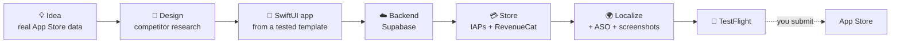

<div align="center">

# AppFactory

**Let your coding agent ship an iOS subscription app, from idea to TestFlight.**

An open-source MCP server for Claude Code, Codex CLI, Gemini CLI and Cursor.
It validates the idea with real App Store data, builds the SwiftUI app, sets up the backend and the store, and
stops at every step that matters so you stay in control.

[](https://pypi.org/project/appfactory/)
[](https://github.com/gbatistuta0/appfactory/actions/workflows/ci.yml)
[](https://github.com/gbatistuta0/appfactory/blob/main/LICENSE)


```bash
claude mcp add appfactory -s user -- uvx appfactory@latest
```

</div>

---

<p align="center"></p>

A real session, sped up. That first step needs no accounts. From there, the same agent can take the idea all the way to a TestFlight build.

## What it does



| Stage | What the agent does with AppFactory |
|---|---|
| **Idea** | Harvests rising and chart-proven apps, scores niches by search demand, competition and staleness, estimates competitor revenue, checks the name is free |
| **Design** | Downloads category leaders' screenshots and icons, writes a differentiated design brief, designs every screen |
| **App** | Scaffolds a SwiftUI app (iOS 17.5+, iPhone) with onboarding, paywalls, settings, analytics hooks and tests |
| **Backend** | Supabase project, auth, edge functions, server-side usage limits, optional AI proxy (keys never ship in the app) |
| **Store** | App Store Connect app, subscriptions with trials and local prices, RevenueCat offerings, StoreKit config kept in sync |
| **Launch assets** | Localized metadata, ASO keywords, legal pages, branded screenshots, preview videos, custom product pages |
| **Ship** | Signing, archive, TestFlight upload. You press "Submit for Review". |

Every stage has a **gate**: the agent can't mark it done until checks pass (the build compiles, the store matches
the spec, screenshots follow the rules...). When something needs you, the run stops with a clear `NEEDS_HUMAN.md`.

## Quickstart

**Requirements:** a Mac and [uv](https://docs.astral.sh/uv/) (`brew install uv`). Xcode and the other tools are
only needed for the services you turn on.

### 1. Add it to your agent

| Agent | Command |
|---|---|
| Claude Code | `claude mcp add appfactory -s user -- uvx appfactory@latest` |
| Codex CLI | `codex mcp add appfactory -- uvx appfactory@latest` |
| Gemini CLI | `gemini mcp add appfactory uvx appfactory@latest` |
| Cursor | `~/.cursor/mcp.json`: `{"mcpServers": {"appfactory": {"command": "uvx", "args": ["appfactory@latest"]}}}` |

### 2. Say "Set up AppFactory"

The agent asks which services you want, one by one, and tells you exactly which keys are missing. Keys are
environment variables on the MCP entry, like any other MCP server. They never go through the chat:

```bash
claude mcp add appfactory -s user \
  -e APPFACTORY_ASC_KEY_ID=ABC123DEFG \
  -e APPFACTORY_ASC_ISSUER_ID=00000000-0000-0000-0000-000000000000 \
  -e APPFACTORY_ASC_KEY_FILEPATH=~/keys/AuthKey_ABC123DEFG.p8 \
  -e APPFACTORY_TEAM_ID=TEAMID1234 \
  -- uvx appfactory@latest
```

Every variable is listed in [docs/SETUP.md](https://github.com/gbatistuta0/appfactory/blob/main/docs/SETUP.md).

### 3. Run it

> Run AppFactory

Before any work the agent asks you about every optional part of the app: free trial or not, hard paywall,
discounted offer, onboarding quiz, mascot, languages, screenshots, preview video, analytics, ratings, Sign in
with Apple... Anything you turn off is skipped, in the app code too.

## Choose what you use

Everything except research is optional. A disabled service's tools do nothing and its stages are skipped, and the
generated app doesn't include its SDK.

| Service | What it enables | Needs |
|---|---|---|
| research | Idea harvesting and validation, ASO research | nothing |
| apple | App Store Connect: apps, subscriptions, metadata, TestFlight | ASC API key, [`asc`](https://github.com/rorkai/App-Store-Connect-CLI) CLI |
| xcode | Local builds, simulator, archives | Xcode, `xcodegen` |
| supabase | Backend: database, auth, edge functions, usage limits | access token, `supabase`, `deno` |
| revenuecat | Subscriptions and entitlements (without it: StoreKit 2 only) | RevenueCat secret key |
| ai | AI features through a server-side proxy (needs supabase) | provider keys, optional |
| firebase | Firebase Analytics | `firebase` CLI |
| github | A private repo and issue workflow per app | `gh` |
| design | Screen design through the claude-design MCP (without it: design locally) | claude-design MCP |
| maestro | End-to-end UI tests on the simulator (needs xcode) | Maestro, Java 17+ |
| lottie | Lottie animations | `node` |

## Safety

Agents make mistakes and read untrusted web content, so AppFactory assumes they will.

- **Human approval for anything irreversible.** Store writes, backend deploys, database changes, GitHub pushes,
  uploads and signing don't run when the agent calls them. They wait until you run `appfactory approve <id>` in
  your own terminal. The agent can't approve on your behalf.
- **You submit.** App Store review submission is always done by you.
- **Dry run by default** for deploys, repo creation and uploads. Destructive SQL always needs approval.
- **Secrets stay on your machine** and are masked in every tool result.
- **Third-party text is data.** App Store listings and reviews are labelled so the agent doesn't follow
  instructions hidden in them.

Threat model and limits: [SECURITY.md](https://github.com/gbatistuta0/appfactory/blob/main/SECURITY.md).

## FAQ

**Does it need Claude?** No. It is a standard MCP server. The run playbook is served by the server itself (tool
`playbook()`, prompt `run`, resource `appfactory://playbook`), so any MCP-capable agent can follow it.

**Why a Mac?** The app is built and tested with Xcode on your machine. Research works anywhere.

**Is my data sent anywhere?** Only to the services you turn on, with your own keys. There is no AppFactory
server and no telemetry.

**Can I change the rules?** Yes. The defaults (subscription with a free trial, hard paywall plus a discounted
offer, a quiz onboarding, 6 app and 8 store languages) are recommendations. You answer each one before a run.

**How do I update?** `@latest` in the MCP command picks up new releases when your agent restarts.

## Docs

- [docs/SETUP.md](https://github.com/gbatistuta0/appfactory/blob/main/docs/SETUP.md): services, keys and environment variables
- [docs/PIPELINE_PLAYBOOK.md](https://github.com/gbatistuta0/appfactory/blob/main/docs/PIPELINE_PLAYBOOK.md): every stage, its order and its gotchas
- [docs/TOOLS.md](https://github.com/gbatistuta0/appfactory/blob/main/docs/TOOLS.md): all 120+ tools
- [SECURITY.md](https://github.com/gbatistuta0/appfactory/blob/main/SECURITY.md), [CONTRIBUTING.md](https://github.com/gbatistuta0/appfactory/blob/main/CONTRIBUTING.md), [AGENTS.md](https://github.com/gbatistuta0/appfactory/blob/main/AGENTS.md)

## Contributing

Issues and pull requests are welcome. See [CONTRIBUTING.md](https://github.com/gbatistuta0/appfactory/blob/main/CONTRIBUTING.md). If AppFactory saves you time, a ⭐
helps other people find it.

## License

[MIT](https://github.com/gbatistuta0/appfactory/blob/main/LICENSE)

<!-- mcp-name: io.github.gbatistuta0/appfactory -->
